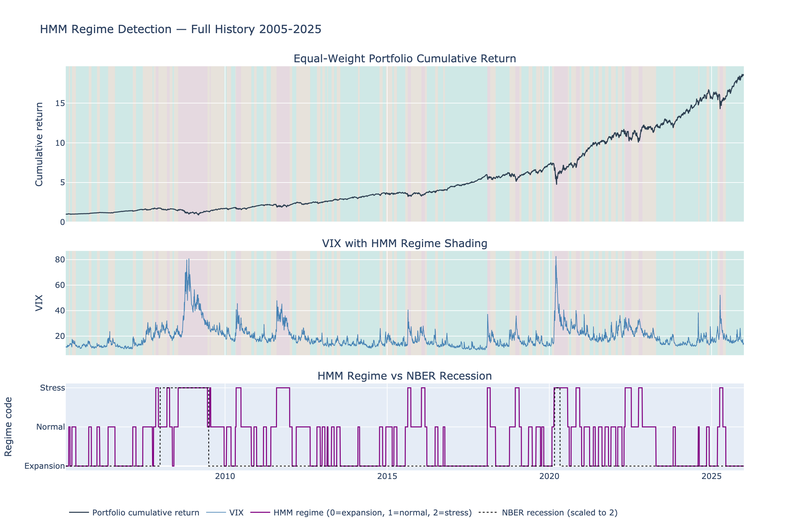
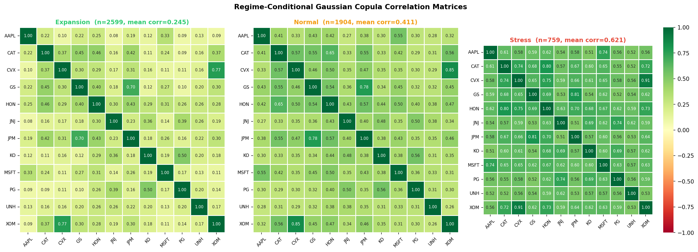
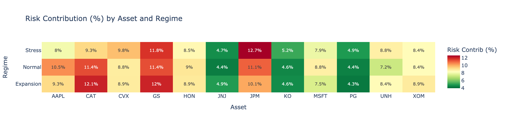

# Market Risk & Portfolio Analytics Framework

A end-to-end market risk analysis framework implementing VaR/ES estimation, statistical backtesting, and regime-dependent correlation modelling across a multi-asset equity portfolio. Built as a personal project to demonstrate quantitative risk management skills relevant to buy-side quant and sell-side risk roles.

## Project Overview

This project constructs a portfolio of 12 US equities across 6 sectors and applies a full risk measurement and validation pipeline:
 - **Regime Detection**: Hidden Markov Model (HMM) identifies Expansion, Normal, and Stress market regimes from return and volatility dynamics, validated against NBER recession indicators.
 - **VaR & ES Estimation**: Compared 3 methods including Historical Simulation, Parametric Normal, and GARCH(1,1)-filtered Historical Simulation, at 99% VaR and 97.5% ES (FRTB standard).
 - **Backtesting**: Full statistical validation including z-test, Kupiec unconditional coverage, Christoffersen conditional coverage, and PIT-based tests (K-S, A-D, C-M).
 - **Dependence & Copula Analysis**: Gaussian copula modelling of joint tail risk, regime-conditional correlation, and Monte Carlo loss simulation.
 - **Risk Attribution**: Euler decomposition of portfolio VaR into component VaRs, regime-conditional attribution, and sensitivity analysis. 

## Portfolio Data

|    Sector  |   Tickers  |
|------------|------------|
| Technology | AAPL, MSFT |
| Financials |  JPM, GS   |
|   Energy   |  XOM, CVX  |
| Healthcare |  JNJ, UNH  |
|  Consumer  |  PG, KO    |
| Industrials|  HON, CAT  | 

**Macro indicators used**:

| Series | Description | Frequency |
|--------|-------------|-----------|
| `USREC` | NBER recession indicator | Monthly |
| `VIXCLS` | CBOE VIX volatility index | Daily |
| `DFF` | Effective Fed Funds Rate | Daily |
| `CPIAUCSL` | CPI all items (YoY inflation derived) | Monthly |
| `T10Y2Y` | 10Y–2Y Treasury yield spread | Daily |
| `T10YIE` | 10Y breakeven inflation rate | Daily |

Sample period: 2005-01-03 -> 2025-12-31 (5,282 trading days)
Data sources: Yahoo Finance (equity prices), FRED (macro indicators)


## Key Results

**Regime Detection**
- HMM with K=3 selected via BIC over $\text{K} \in \{2,3,4,5\}$
- Near-tridiagonal transition matrix confirms sequential regime evolution
- Stress regime achieves 70% recall on NBER recession days
- Average pairwise correlation rises from 0.22 (Expansion) to 0.62 (Stress) — out-of-sample validation of regime classification


**VaR & ES Estimation (250-day rolling window)**
| Method | Mean VaR 99% | Mean ES 97.5% | Stress VaR (mean) |
|----------|:-----------:|:------------:|:-----------------:|
| Historical Simulation | 2.95% | 2.97% | 4.84% |
| Parametric (Normal) | 2.50% | 2.51% | 3.87% |
| GARCH(1,1)-filtered | 2.66% | 2.74% | 5.69% |

**Backtesting Summary**

| Method | Exceedance Rate | Reject LRuc | Reject LRind | KS reject | AD reject | CM reject |
|:---------|:----------------:|:-------------:|:--------------:|:----------:|:---------:|:---------:|
| Historical Simulation | 1.71% | Yes | Yes | No | Yes | No |
| Parametric (Normal) | 2.64% | Yes | Yes | Yes | Yes | Yes |
| GARCH(1,1)-filtered | 1.55% | Yes | **No** | Yes | Yes | Yes |


GARCH is the only model passing the independence test. Its time-varying volatility forecast successfully breaks up exception clusters. All models fail unconditional coverage, with failures concentrated in stress regimes (HS: 5.14%, Parametric: 7.51%, GARCH: 2.50%).

**Copula & Dependence Analysis**
- Mean pairwise Gaussian copula correlation rises from 0.245 (Expansion) to 0.621 (Stress)
- Monte Carlo VaR (99%) under regime-conditional copula: 1.49% (Expansion), 2.61% (Normal), 6.64% (Stress)
- VaR-based diversification benefit falls from 50.0% (Expansion) to 27.1% (Stress)


**Risk Attribution**
- JPM and GS contribute the largest share of portfolio VaR (11.9% and 11.7%) despite equal 8.33% weights
- AAPL is the most efficient position: 18.2% return contribution vs 8.8% risk contribution
- Increasing allocations to JNJ, KO, PG reduces portfolio VaR because their MVaRs are below portfolio average
- JPM's risk contribution rises from 10.1% (Expansion) to 12.7% (Stress), which is the largest regime-driven shift


## Repository Structure

```
portfolio-risk-system/
├── README.md
├── requirements.txt
├── .gitignore
│
├── data/
│   ├── raw/
│   │   ├── prices/   <- equity_prices.csv, equity_metadata.csv
│   │   └── macro/    <- macro_fred.csv
│   ├── processed/
│       ├── returns/  <- log_returns.csv, simple_returns.csv, portfolio_return.csv
│       ├── regimes/  <- regime_labels.csv, hmm_params.json, macro_daily.csv, regime_corr_summary.csv
│       ├── risk_metrics/  <- rolling_var_es.csv, rolling_var_es_summary.csv, exceedance_summary.csv
|       ├── backtesting/ <- backtest_summary.csv, exceedance_series.csv, pit_series.csv, regime_backtest.csv
|       ├── copula/ <- copula_corr_full.csv, copula_corr_expansion.csv, copula_corr_normal.csv, copula_corr_stress.csv, copula_regime_summary.csv, copula_sim_summary.csv
|       ├── attribution/ <- risk_attribution_full.csv, risk_attribution_expansion.csv, risk_attribution_normal.csv, risk_attribution_stress.csv, risk_contrib_by_regime.cvs, sensitivity_analysis.csv
|
|   └── figures/    <- static PNG exports for GitHub rendering     
│
├── notebooks/
│   ├── 01_data_and_regimes.ipynb     ( Data prep, HMM regime detection )
│   ├── 02_var_es_estimation.ipynb    ( VaR/ES: HS, Parametric, GARCH )
│   ├── 03_backtesting.ipynb          ( Statistical backtesting framework )
│   ├── 04_copula_analysis.ipynb      ( Dependence & copula )
│   └── 05_risk_attribution.ipynb     ( Component VaR, Marginal VaR, Sensitivity Analysis)
│
└── src/
    └── data_loader.py     <- Data acquisition (yfinance + FRED)
```

## Setup & Reproduction

1. Clone the repository
```bash
git clone https://github.com/xzdada/portfolio-risk-system.git
cd portfolio-risk-system
```
2. Install dependencies
```bash
pip install -r requirements.txt
```
3. Get a FRED API key
Register at fred.stlouisfed.org and create a .env file in the project root:
```bash
FRED_API_KEY=registered_key_here
```
4. Download data
```bash
python src/data_loader.py --fred-key registered_key_here
```
5. Run notebooks in order
Note that Notebooks must be run sequentially as each notebook reads outputs saved by the previous one.

## Methodology Notes

**Why 97.5% ES instead of 99% VaR?**
The Fundamental Review of the Trading Book (FRTB) replaced Basel II's 99% VaR with 97.5% ES as the primary capital measure. ES is a coherent risk measure satisfies sub-additivity, which VaR does not fit, and more sensitive to tail severity. We implement both for comparison.

**Why GARCH-filtered Historical Simulation?**
Plain HS assigns equal weight to all observations in the rolling window, making it slow to react to volatility regime changes. GARCH(1,1) captures volatility clustering ($\sigma_t^2 = \omega + \alpha\epsilon_{t-1}^2 + \beta\sigma_{t-1}^2$) and scales the empirical residual distribution by the one-step-ahead volatility forecast, combining non-parametric tail estimation with time-varying risk sensitivity.

**Why HMM for regime detection?**
Threshold-based approaches (e.g. VIX > 25 = stress) require arbitrary parameter choices. HMM is fully data-driven: it infers latent market states from the joint distribution of portfolio return and rolling volatility, with state persistence modelled explicitly via the transition matrix. BIC model selection over $\text{K} \in \{2,3,4,5\}$ and external NBER validation ensure the regimes are statistically and economically meaningful.

**Why zero drift in risk attribution VaR?**
For short-horizon (1-day) VaR, the daily drift term is negligible relative to daily volatility. Ignoring drift avoids introducing mean estimation error into the decomposition.

## References
